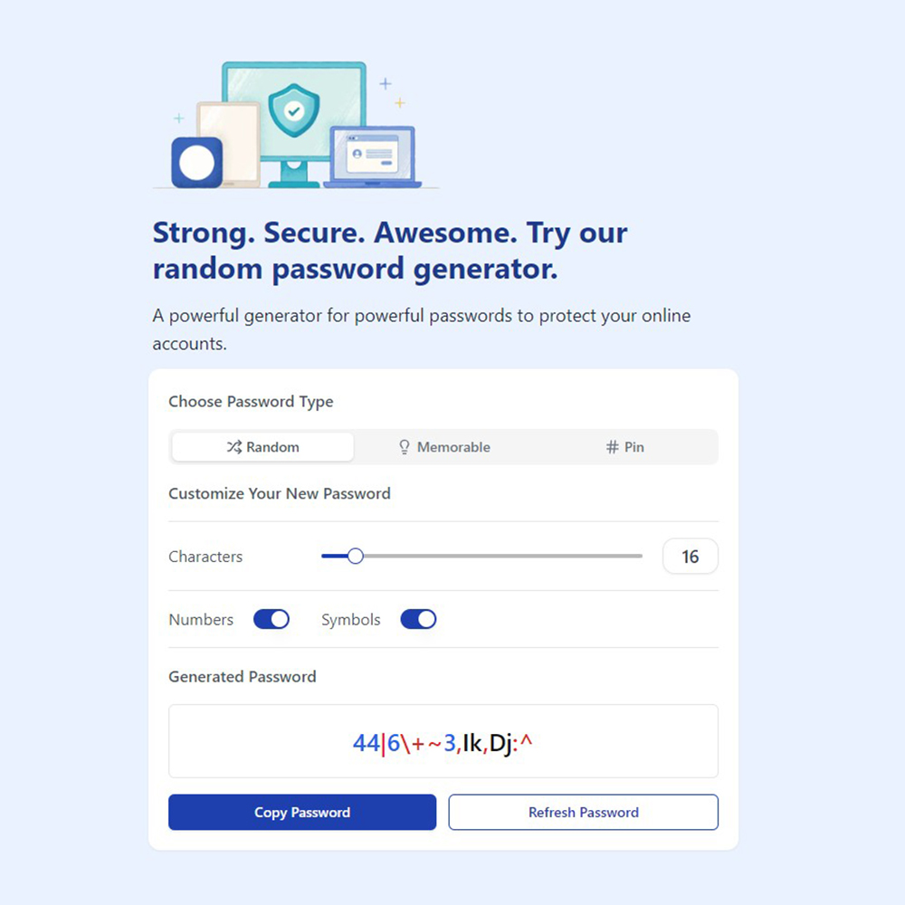

# Secure Password Generator

In an increasingly digital world, safeguarding our online identities is more crucial than ever. The Secure Password Generator is a React JS project designed to help users create robust and memorable passwords tailored to various needs.

As cyber threats become more sophisticated, the need for secure password management is paramount. This project not only promotes better password practices but also educates users on the importance of using varied types of passwords for different accounts. By simplifying the password creation process, the Secure Password Generator encourages users to take control of their online security, ultimately leading to safer digital experiences.

## Requirements

- Basic HTML, CSS & Javascript knowledge.
- Basic React JS knowledge.

## How to Install & Run

To run the application, follow these steps:

1. Clone the repository or download it as a ZIP file.
2. In a terminal, navigate to the folder where the application is located.
3. Run the **npm install** command to install all the necessary dependencies.

```shell
npm install
```

4. Run the **npm run dev** command to start the application in development mode.

```shell
npm run dev
```

5. Open your browser and navigate to **http://localhost:5173** to use the application.

```shell
http://localhost:5173
```

## Application Features

This tool addresses the common challenge of password creation by offering three distinct password types and more user friendly interactivity:

- Random Passwords: Generate high-security passwords that include a diverse mix of uppercase and lowercase letters, numbers, and special characters. These passwords are ideal for securing sensitive accounts such as banking or email services, where maximum protection is a must.
- Memorable Passwords: This feature offers a clever twist on password creation by using common phrases or easy-to-remember combinations. These passwords provide a balance between security and usability, making them perfect for users who find it difficult to remember complex passwords yet still want to maintain a decent level of security.
- PIN Codes: For those who prefer straightforward access methods, this generator creates secure PIN codes. These codes are suitable for applications that require quick entry, such as mobile devices or security systems, while still ensuring a level of protection.
- User-Friendly Interface: Designed with simplicity in mind, the interface allows users of all technical levels to easily generate passwords.
- Customizable Options: Users can select the length and complexity of their passwords, tailoring them to fit their specific security requirements.
- Accessibility: The application is built to be responsive, ensuring a seamless experience across various devices, including desktops, tablets, and smartphones.
- Real-Time Generation: As users adjust their preferences, passwords are generated in real-time, allowing for immediate feedback and selection.

## Technologies Used

The Secure Password Generator is built with React JS, the world’s most popular frontend library, ensuring a smooth and dynamic user experience. This project also leverages ShadCN UI for sleek, modern components and TailwindCSS for responsive, utility-first styling, making it not only functional but visually appealing.

- React JS
- Shadcn UI
- TailwindCSS

## Contribution

If you'd like to contribute to this project, feel free to submit a pull request. Before doing so, be sure to create a separate branch for your changes.

## Buy A Coffee

Like my works and want to support me?

<a href="https://www.buymeacoffee.com/hossainpalin" target="_blank"></a>

## Screenshots



## Live demo

Live previews are the best way for a better understanding of the application's user interface.

[Click here...](https://secure-password-gen.vercel.app/)
